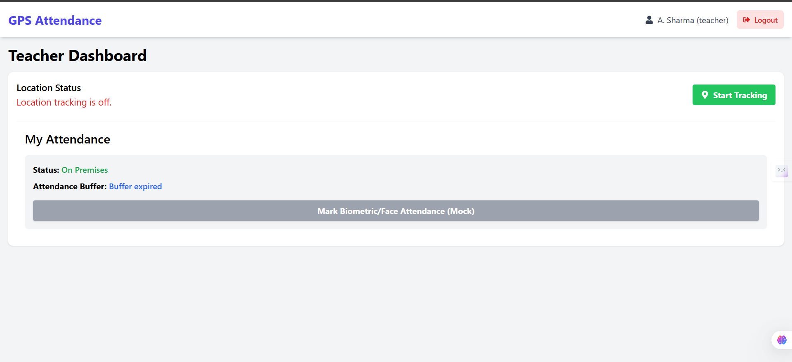

# 📍 Geo-Fenced Smart Attendance System

  

A full-stack automated attendance solution that replaces manual logs with GPS-based geofencing. This system verifies teacher presence within a 200m campus radius using geospatial logic and provides a real-time command center for administrators.

🔗 **Live Demo:** [https://gps-tracker-seven.vercel.app](https://gps-tracker-seven.vercel.app)

---

## 📸 Screenshots

### Admin Command Center

*Real-time map view of all staff members with live status updates.*

### Teacher Interface

*Mobile-responsive interface for teachers to view their live location status.*

---

## 🚀 Key Features

* **📍 GPS Geofencing:** Automatically marks attendance when a user enters the defined 200m campus radius.
* **👮 Role-Based Access:** Secure Admin and Teacher login portals using JWT authentication.
* **⏱️ Smart Buffer Window:** Activates a 30-minute countdown for biometric verification once the user enters the premises.
* **📊 Live Admin Dashboard:** Interactive Leaflet map showing real-time location and status (Inside/Outside) of all staff.
* **📈 Reporting:** Export daily attendance logs to CSV format.

---

## 🛠️ Tech Stack

* **Frontend:** React.js, Vite, Tailwind CSS, Leaflet Maps
* **Backend:** Node.js, Express.js
* **Database:** MongoDB Atlas, Mongoose
* **Auth:** JWT (JSON Web Tokens), BCrypt
* **Deployment:** Vercel (Frontend), Render (Backend)

---

## ⚙️ Installation & Setup

1.  **Clone the repository**
    ```bash
    git clone [https://github.com/JayaantKumar/gps-tracker.git](https://github.com/JayaantKumar/gps-tracker.git)
    cd gps-tracker
    ```

2.  **Install Dependencies (Backend)**
    ```bash
    cd backend
    npm install
    ```

3.  **Install Dependencies (Frontend)**
    ```bash
    cd ../frontend
    npm install
    ```

4.  **Environment Variables**
    Create a `.env` file in the `backend` folder:
    ```env
    PORT=5000
    MONGO_URI=your_mongodb_connection_string
    JWT_SECRET=your_secret_key
    ```
    Create a `.env` file in the `frontend` folder:
    ```env
    VITE_API_URL=http://localhost:5000/api
    ```

5.  **Run the App**
    * Backend: `npm run dev` (inside backend folder)
    * Frontend: `npm run dev` (inside frontend folder)

---

## 🧠 How It Works (Geofencing Logic)

The system utilizes the **Haversine Formula** on the backend to calculate the precise distance between the user's GPS coordinates and the campus center.

1.  Browser fetches GPS coordinates (`navigator.geolocation`).
2.  Coordinates sent to Node.js API.
3.  Server calculates distance in meters.
4.  **If Distance < 200m:** Status = "On Premises".
5.  **If Distance > 200m:** Status = "Outside".

---

## 📬 Contact

**Jayaant Kumar**
* [GitHub Profile](https://github.com/JayaantKumar)
* [LinkedIn](https://www.linkedin.com/in/jaayant-kumar)